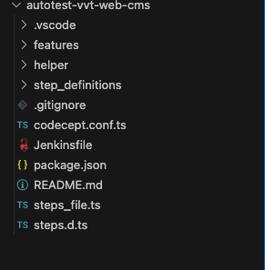

# CodeceptJS

## Giới thiệu

CodeceptJS là một framework kiểm thử end-to-end hiện đại cho các ứng dụng web. Nó đơn giản hóa quá trình viết và thực thi các bài kiểm thử tự động bằng cách sử dụng cú pháp dễ đọc và dễ hiểu.

## Tính năng chính

- **Đa nền tảng**: Hỗ trợ nhiều trình điều khiển như Playwright, Puppeteer, WebDriver, và TestCafe.
- **Cú pháp BDD**: Viết các kịch bản kiểm thử bằng ngôn ngữ tự nhiên.
- **Tích hợp AI**: Sử dụng CodeceptJS AI để tạo và duy trì các bài kiểm thử.
- **Báo cáo trực quan**: Tạo báo cáo chi tiết với ảnh chụp màn hình và video.
- **Chạy song song**: Thực thi các bài kiểm thử đồng thời để tiết kiệm thời gian.
- **Mở rộng**: Dễ dàng tùy chỉnh và mở rộng thông qua các plugin và helper.

## Cài đặt
Khởi tạo nhanh dự án Nodejs
```
  npm init -y
```
Bắt đầu một dự án sử dụng CodeceptJS với Playwright làm framework
```
npm install codeceptjs playwright
```
Khởi tạo codeceptjs
```
npx codeceptjs init
```
Bạn cần trả lời một số câu hỏi trước khi kết thúc khởi tạo:

? Where are your tests located? (./*_test.js) 

 👉 Các bài test sẽ nằm ở đâu, mình để mặc định và enter

? What helpers do you want to use? (Use arrow keys)

 👉 Helpers nào bạn muốn sử dụng (mặc định là Playwright) 

? Where should logs, screenshots, and reports to be stored? (./output) 

 👉 Bạn muốn lưu trữ các lỗi , ảnh capture và các báo cáo ở đâu, mình để mặc định (thư mục output) và enter

? Do you want localization for tests? (See https://codecept.io/translation/) (Use arrow keys)

 👉 Bạn có muốn bản địa hoá cho các bài tests, mình để mặc định là English

? [Playwright] Base url of site to be tested (http://localhost) 

 👉 Đường dẫn của website sẽ cần được kiểm tra, mình để mặc định là localhost, tuy nhiên các bạn có thể thay thế bằng các đường dẫn khác (ex: https://github.com, https://techmaster.vn, ...)

? [Playwright] Show browser window (Y/n) 
 👉 Hiển thị cửa sổ trình duyệt, nhấn Y (hoặc Yes) và enter

? [Playwright] Browser viewport size (1200x900) 
 👉 Kích thước cửa sổ trình duyệt, mình để mặc định và enter, các bạn có thể sử dụng các kích thước khác nhau.

Tạo một bài test:
----------------------
? Feature which is being tested (ex: account, login, etc): (Filename)

? Filename of a test (Login_test.ts) 

## Gherkin

Gherkin là một ngôn ngữ viết kịch bản dành cho việc mô tả hành vi của phần mềm theo định dạng dễ hiểu cho cả những người không có kỹ năng lập trình. Nó được sử dụng trong Behavior-Driven Development (BDD) để viết các bài kiểm thử (test cases) dựa trên cách người dùng tương tác với hệ thống.

```
Feature: Đăng nhập vào trang web

  Scenario: Đăng nhập thành công với tài khoản hợp lệ
    Given người dùng ở trang đăng nhập
    When người dùng nhập tên đăng nhập "user1" và mật khẩu "password1"
    Then người dùng sẽ được chuyển đến trang chủ
```
Để có thể viết 1 kịch bản dưới dạng BDD thì chúng ta phải thêm trong file (codecept.conf.ts)

``` typescript
import { setHeadlessWhen, setCommonPlugins } from "@codeceptjs/configure";
// turn on headless mode when running with HEADLESS=true environment variable
// export HEADLESS=true && npx codeceptjs run
setHeadlessWhen(process.env.HEADLESS);
// enable all common plugins https://github.com/codeceptjs/configure#setcommonplugins
setCommonPlugins();
export const config: CodeceptJS.MainConfig = {
tests: "./_test.ts",
output: "./output",
helpers: {
Playwright: {
browser: "chromium",
url: "http://localhost",
show: true,
chromium: {
args: [
'--disable-extensions',
'--disable-gpu',
'--no-sandbox',
'--disable-dev-shm-usage'
]
}
},
},
multiple: {
basic: {
browsers: ["chromium", "firefox"],
},
},
include: {
I: "./steps_file",
},
name: "AutomationJS",
gherkin: {
features: "./features//.feature",
steps: "./step_definitions//.ts",
},
```
Đây là cấu hình cho Gherkin trong CodeceptJS:

- gherkin: Đây là phần cấu hình cho việc sử dụng Gherkin trong dự án.
- features:
- Đường dẫn: "./features/**/*.feature"
Ý nghĩa: Chỉ định vị trí của các file feature Gherkin.
Cú pháp **/*.feature cho phép tìm kiếm tất cả các file có đuôi .feature trong thư mục features và các thư mục con của nó.
- steps:
Đường dẫn: "./step_definitions/**/*.ts"
Ý nghĩa: Chỉ định vị trí của các file định nghĩa bước (step definitions).
Tìm kiếm tất cả file TypeScript (.ts) trong thư mục step_definitions và các thư mục con.

Sau khi khởi tạo codecept thành công, các bạn sẽ thấy cấu trúc thư mục như sau:



## Khởi động 
``` sh 
"scripts": {
  "dev": "npx codeceptjs run --verbose --features",
  "prod": "npx codeceptjs run --features --plugins allure"
},
```
Phần này định nghĩa các lệnh tắt mà bạn có thể chạy bằng npm hoặc yarn. Cụ thể:

"dev":
- Lệnh này chạy CodeceptJS trong môi trường phát triển.
- npx codeceptjs run chạy các bài kiểm tra CodeceptJS.
- --verbose hiển thị thông tin chi tiết trong quá trình chạy.
- --features chỉ định rằng chỉ chạy các tệp feature (thường là các kịch bản Gherkin).
"prod":

Lệnh này chạy CodeceptJS trong môi trường sản xuất.

Tương tự như "dev", nhưng không có --verbose.

--plugins allure kích hoạt plugin Allure để tạo báo cáo kiểm tra.
Để sử dụng các lệnh này, bạn có thể chạy:
- npm run dev hoặc yarn dev cho môi trường phát triển.
- npm run prod hoặc yarn prod cho môi trường sản xuất.
Các lệnh này giúp tự động hóa quá trình chạy kiểm tra và tạo báo cáo, giúp việc kiểm tra và gỡ lỗi trở nên dễ dàng hơn trong các môi trường khác nhau.

## Tài liệu

Để biết thêm thông tin chi tiết, vui lòng tham khảo [tài liệu chính thức](https://codecept.io/helpers/Playwright/#playwright).

## Đóng góp

Chúng tôi luôn chào đón sự đóng góp từ cộng đồng. Nếu bạn muốn đóng góp, hãy tham khảo [hướng dẫn đóng góp](CONTRIBUTING.md).

## Giấy phép

CodeceptJS được phát hành dưới [Giấy phép MIT](LICENSE).

## Hỗ trợ

Nếu bạn gặp vấn đề hoặc có câu hỏi, hãy tạo một issue trên [GitHub](https://github.com/codeceptjs/CodeceptJS/issues) hoặc tham gia [cộng đồng Slack](https://codecept.io/slack) của chúng tôi.


